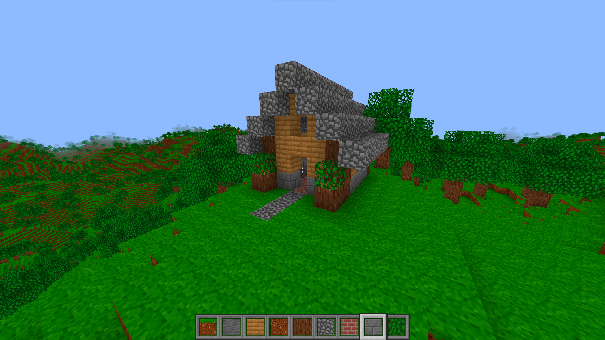

# Voxelverse

A voxel game written in a custom engine.



## How to Build

Currently only tested on Windows using MSVC, MinGW-GCC, and MinGW-Clang.

Required Dependencies

* [CMake](https://cmake.org/) tested with version 3.28.1
* [Vulkan SDK](https://vulkan.lunarg.com/) tested with version 1.3.268.0
* glslangValidator (This should be callable from `PATH` and should come with Vulkan SDK)

```bash
git clone https://github.com/orosmatthew/voxelverse
cd voxelverse
# You can also specify Debug or RelWithDebInfo for CMAKE_BUILD_TYPE
cmake -S . -B build -DCMAKE_BUILD_TYPE=Release
cmake --build build
```

Depending on your build tool, the `voxelverse.exe` will be located somewhere in the `build/` directory. Note that
the `res/` directory must be in the current-working-directory (cwd) of the executable. So if you want to distribute the
executable, you must have the executable within the same directory of `res/`.

```
|- voxelverse/
|  |- res/
|  |  |- bin/
|  |  |- atlas.png
|  |  |- ...
|  |- voxelverse.exe
```

## Technologies Used

* Custom Vulkan abstraction (MVE - Mini Vulkan Engine `/lib/mve`)
* Custom math library (`/lib/mve/math`)
* [Vulkan](https://www.lunarg.com/vulkan-sdk/) graphics API
* [LevelDB](https://github.com/google/leveldb) for save files
* [GLFW](https://www.glfw.org/) for windowing
* [Fast Noise Lite](https://github.com/Auburn/FastNoiseLite) for world generation
* [Cereal](https://uscilab.github.io/cereal/) for serialization
* [FreeType](https://freetype.org/) for font rendering
* [lz4](https://github.com/lz4/lz4) for save file compression
* [spdlog](https://github.com/gabime/spdlog) for logging
* [BS::thread_pool](https://github.com/bshoshany/thread-pool) for multithreading
* [stb_image.h](https://github.com/nothings/stb) for image loading
* [Vulkan Memory Allocator](https://gpuopen.com/vulkan-memory-allocator/) for Vulkan memory allocations
* [SpirV-Reflect](https://github.com/KhronosGroup/SPIRV-Reflect) for shader reflection

## License

MIT license. Details in `LICENSE.txt`
